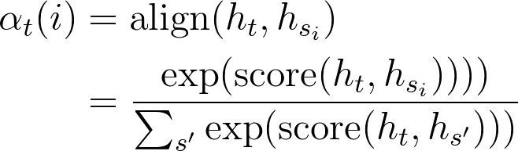
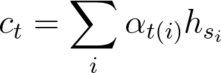
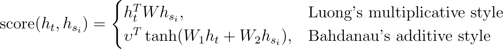
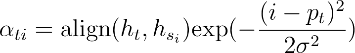

# Attention

The main idea of attention mechanism is to know what the decoder state should be at time t in a sequence-to-sequence model. Besides, attention-based model are classified into two categories, global and local.

Common to these two types of attention is that both of them take the hidden state $$h_t$$ from the top of a stacking RNN cells (LSTM, GRU, ...) layer, and want to derive a context vector $$c_t$$ such that
<!---
\begin{align*}
\widetilde{h_t} &= \tanh(W^c [h_t^T, c_t^T]^T) \\
y_t &= \text{softmax}(W^o \widetilde{h_t})
\end{align*}
-->

However, global and local attention differ in how the context vector $$c_t$$ is derived.

## Global

In global attention, we want to compute a variable-length alignment vector  $$\alpha_t$$, whose length equals the number of time steps on the source side (encoder), based on the encoder hidden states $$h_{s_i}$$.
<!---
\begin{align*}
\alpha_{ti} &= \text{align}(h_t, h_{s_i}) \\
&= \frac{\text{exp}(\text{score}(h_t, h_{s_i}))))}{\sum_{s'} \text{exp}(\text{score}(h_t, h_{s'})))}
\end{align*}
-->

such that
<!---
\begin{align*}
c_t = \sum_i \alpha_{ti} h_{s_i}
\end{align*}
-->

where score could be any reasonable function such as cosine similarity, neural network, etc. The following are score functions used by Luong and Bahdanau.
<!---
$$
\text{score}(h_t, h_{s_i}) =
\begin{cases}
h_t^T W h_{s_i},& \text{Luong's multiplicative style} \\
\upsilon^T \tanh(W_1 h_t + W_2 h_{s_i}),& \text{Bahdanau's additive style}
\end{cases}
$$
-->

## Local

The main drawback of global attention is the expensive computation and potential impractical to translate longer sequences, e.g., paragraphs or documents. Therefore, we can compute $$\alpha_t$$ with limited hidden states of the encoder.

In details, we can compute an aligned position (a scalar) $$p_t$$ such that $$\alpha_t$$ and $$c_t$$ are derived from the set of hidden states within the window $$[p_t - D, p_t + D]$$; $$D$$is empirically selected. Note that in local approach, $$\alpha_t$$ is (2D+1)-dimensional.

In [Luong et al. 2015](https://arxiv.org/abs/1508.04025), they proposed two ways to determine $$p_t$$.

<!---
$$
p_t =
\begin{cases}
t,& \text{Monotomic alignment} \\
S \cdot \text{sigmoid}(\upsilon_p^T \tanh(W_p h_t)), & \text{Predictive alignment}
\end{cases}
$$
-->

where  S is the source sentence length and $$p_t \in [0, S]$$ as a result of sigmoid.

Besides, we can further favor alignment point near $$p_t$$ by a Gaussian distribution centered around $$p_t$$.
<!---
$$
\alpha_{ti} = \text{align}(h_t, h_{s_i}) \text{exp}(- \frac{(i - p_t)^2}{2 \sigma^2})
$$
-->

Empirically $$\sigma = \frac{D}{2}$$

## Implementation Details

In paper works of [Luong et al. 2015](https://arxiv.org/abs/1508.04025), and [Bahdanau et al. 2015](https://arxiv.org/pdf/1409.0473.pdf), they use hidden states at the top LSTM layers in both the encoder and decoder. 

While, in the implementation of [Google NMT Model](https://github.com/tensorflow/nmt/blob/master/nmt/gnmt_model.py#L167), they use the hidden states at the bottom layer of the decoder.

## References

* [Luong et al. 2015](https://arxiv.org/abs/1508.04025)
* [Bahdanau et al. 2015](https://arxiv.org/pdf/1409.0473.pdf)
* [Google NMT](https://github.com/tensorflow/nmt)
