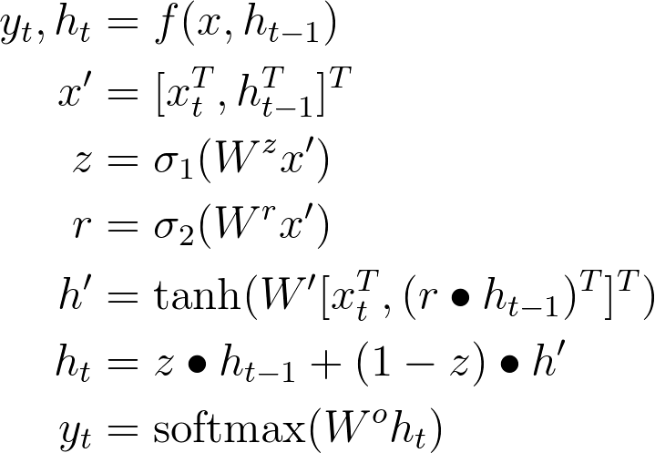
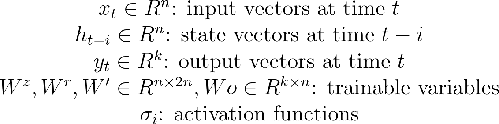

# GRU (Gated Recurrent Unit)

<!---
\begin{align*}
y_t, h_t &= f(x, h_{t-1}) \\
x' &= [x_t^T, h_{t-1}^T]^T \\
z &= \sigma_1(W^z x') \\
r &= \sigma_2(W^r x') \\
h' &= \tanh(W' [x_t^T, (r \bullet h_{t-1})^T]^T)\\
h_t &= z \bullet h_{t-1} + (1 - z) \bullet h' \\
y_t &= \text{softmax}(W^o h_t)
\end{align*}
\begin{array}{c}
x_t \in R^n \text{: input vectors at time }t \\
h_{t-i} \in R^n \text{: state vectors at time }t-i \\
y_t \in R^k \text{: output vectors at time }t \\
W^z, W^r, W' \in R^{n \times 2n}, Wo \in R^{k \times n} \text{: trainable variables} \\
\sigma_i \text{: activation functions}
\end{array}
-->

 

 

## References

* [Prof. Hung-Yi Lee](http://speech.ee.ntu.edu.tw/~tlkagk/index.html)
