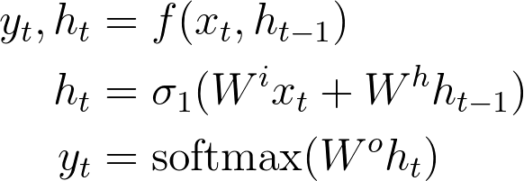
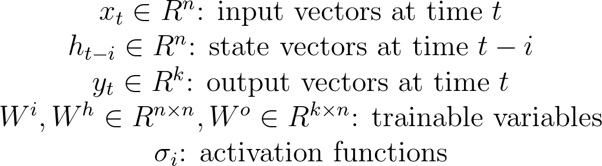

# RNN

<!---
\begin{align*}
y_t, h_t &= f(x_t, h_{t-1}) \\
h_t &= \sigma_1(W^i x_t + W^h h_{t-1}) \\
y_t &= softmax(W^o h_t)
\end{align*}
\begin{array}{c}
x_t \in R^n \text{: input vectors at time }t \\
h_{t-i} \in R^n \text{: state vectors at time }t-i \\
y_t \in R^k \text{: output vectors at time }t \\
W^i, W^h \in R^{n \times n}, W^o \in R^{k \times n} \text{: trainable variables} \\
\sigma_i \text{: activation functions}
\end{array}
-->

 

 

## References

* [Prof. Hung-Yi Lee](http://speech.ee.ntu.edu.tw/~tlkagk/index.html)

